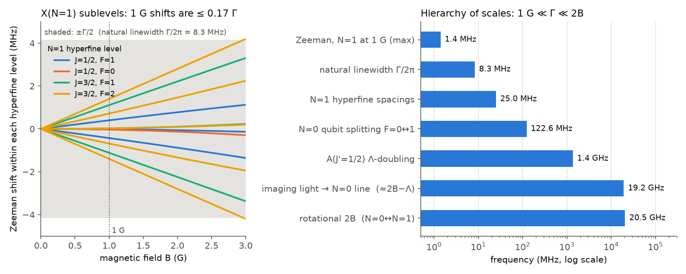

# Simulation plan: rapid resonant imaging of CaF in tweezers at finite magnetic field

**Status: this is a plan for review. No simulation has been run yet.**
The only code so far is `scripts/plan_estimates.py`. It diagonalises the X-state
Hamiltonian and works out the back-of-envelope numbers below, which are
reproducible with `python scripts/plan_estimates.py`.

---

## 0. Upshot (preliminary, from estimates only)

The question: does the rapid resonant N=1 imaging of
[arXiv:2406.02391](https://arxiv.org/abs/2406.02391) still work at B ≈ 1 G, and how
much does it disturb a qubit stored in N=0?

1. **Resonance shift at 1 G is not the problem.** The largest Zeeman shift in
   X(N=1) at 1 G is 1.40 MHz, which is 0.17 Γ (Γ/2π = 8.29 MHz). By itself
   this changes the scattering rate by about 10% or less.
2. **The real question is dark states.** At 1 G the N=1 sublevels precess at
   ω_L/2π = 0.43, 1.11 and 0.70 MHz (F=1⁻, F=1⁺, F=2; F=0 has no linear
   shift). The optical pumping rate into dark states is about the same size,
   ~0.5–2 MHz for s ≈ 1–10. Whether 1 G *helps* (it remixes dark states) or
   *hurts* (it breaks the zero-field remixing the scheme relied on) depends on
   three things:
   - the polarization scheme
   - the angle between **B** and the light polarization
   - the tweezer's tensor light shift on N=1, which at mK depths may be larger
     than the Zeeman shift

   Rate equations can't capture this; it needs the optical Bloch equations (OBE).
3. **Cross talk on N=0 barely depends on B.** The imaging light sits
   Δ₀ ≈ 2B_rot − Λ ≈ 19.2 GHz from the nearest N=0 line, X(N=0)→A(J′=½,−).
   A 1 G field moves that line by only 1.4 MHz/19.2 GHz ≈ 7×10⁻⁵ of Δ₀.
   Parity also guarantees that an N=0 molecule can never become bright:
   A(−) decays only to N=0 and N=2. The disturbance to the qubit is
   off-resonant scattering plus light shifts:

   $$\varepsilon_{\rm sc}\approx N_{\rm sc}\,\kappa\left(\frac{\Gamma}{2\Delta_0}\right)^2\frac{\Gamma s_{\rm tot}/2}{R_1}\sim 10^{-4}\text{–}10^{-3}\quad(N_{\rm sc}=500,\ s_{\rm tot}=1\text{–}30)$$

   Here $(\Gamma/2\Delta_0)^2 = 4.7\times10^{-8}$, R₁ is the N=1 scattering rate,
   and κ ~ ⅓ is an angular factor to be computed.
4. **The trade-off to optimise.** Because R₁ saturates while the N=0 scattering
   keeps growing, the cross talk per detected photon scales roughly as
   (1+s). Stray-light background per signal photon does the same. So lower
   saturation is better for both, but it:
   - makes imaging slower
   - narrows the line, so the molecule falls out of resonance as it heats and
     moves through the trap's differential light shift
   - leaves more time for loss channels that scale with time

   The optimum is expected at s ~ 1–5. The simulation will locate it and
   quantify it.

*Left: Zeeman shifts of the 12 X(N=1) sublevels, computed from the full
hyperfine Hamiltonian. The shaded band is ±Γ/2. Right: the ladder of
frequency scales that controls both answers.*

---

## 1. What the references say, and what I still need

The environment's network policy blocks arxiv.org, journals.aps.org, par.nsf.gov
and doylegroup.harvard.edu, so I could not read the full texts. What I could get
from web-search summaries:

| Ref | Relevant content |
|---|---|
| [1807.00740](https://arxiv.org/abs/1807.00740) Cheuk *et al.*, PRL 121, 083201 | Λ-enhanced gray-molasses imaging in an ODT. 2700 photons scattered with 90% retained at 20 µK. 200× more photons than resonant imaging. |
| [2208.12159](https://arxiv.org/abs/2208.12159) Holland, Lu, Cheuk, PRL 131, 053202 | Bichromatic imaging in tweezers. F = 97.7(2)%, non-destructive F = 95.5(6)%. Loss channels characterised: two-photon decay, and trap-light admixture of higher excited states. |
| [2406.02391](https://arxiv.org/abs/2406.02391) Holland, Lu, Li, Welsh, Cheuk, PRX (2025) | Erasure conversion. N=1 is imaged on X(v=0,N=1)→A(v=0,J′=½,+) with all hyperfine lines addressed; molecules explore all 12 N=1 sublevels. The qubit is in the N=0 hyperfine manifold. Imaging needs a tweezer ~20× deeper than the coherence depth. "Composite erasure detection" puts a hyperfine π (echo) pulse halfway through the image to cancel dephasing. |

**Please confirm, or let me read the papers** (either add `arxiv.org` to the
environment's allowed domains, or drop the PDFs in `refs/`). These are the
parameters of the rapid resonant scheme I have to assume otherwise:

| Parameter | Default assumption (to confirm) |
|---|---|
| Imaging beam geometry | 1 retro-reflected beam pair (Doppler cooling along one axis only), plus an option for 3D |
| Polarization, and remixing method at B=0 | linear; remixing by polarization modulation at f_pm ~ 1–10 MHz, or by a lin⊥lin standing wave |
| Detuning | common Δ ≈ −0.5 Γ to +0.5 Γ relative to the light-shifted resonance |
| Intensity per hyperfine sideband | s = 0.3–30 (scan) |
| Sideband set | 4 components at the N=1 levels 0, 76.3, 122.9, 147.8 MHz |
| Repumps | v=1 via A(v=0) at 628 nm, coherent; v=2,3 as effective rates |
| Imaging duration | 50 µs – 2 ms (scan) |
| Tweezer λ, depth, waist during imaging | ~780 nm, 1–4 mK (scan), w₀ ≈ 0.8 µm |
| Initial temperature | 40 µK |
| Collection efficiency η | 4% (NA ≈ 0.65 → 12% solid angle × 0.35 transmission·QE) |
| Camera | EMCCD (excess-noise factor √2) or qCMOS (0.3 e⁻ read noise) |
| Resonant stray-light background | scan 0.01–1 counts per ROI per 100 µs |

---

## 2. Physical model

### 2.1 Level structure (`caf/structure.py`)

**X²Σ⁺ (v=0,1), N=0–3, uncoupled basis |N m_N; m_S; m_I⟩:**

$$H_X = B N^2 + \gamma\,\mathbf N\!\cdot\!\mathbf S + b_F\,\mathbf I\!\cdot\!\mathbf S + c\sqrt{\tfrac23}\,[\mathbf I\otimes\mathbf S]^{(2)}\!\cdot C^{(2)}(\hat n) + C_I\,\mathbf N\!\cdot\!\mathbf I + g_S\mu_B B_z S_z - g_I\mu_N B_z I_z + H_{\rm LS}^{\rm tw}$$

The constants are from Childs *et al.* 1981: B = 10267.54 MHz, γ = 39.659 MHz,
b = 109.18 MHz, c = 40.12 MHz, b_F = b + c/3 = 122.56 MHz. This is already
implemented and checked. It reproduces the known N=1 levels (0, 76.26, 122.92,
147.82 MHz) and the N=0 splitting of 122.555 MHz. At 1 G it gives:

- N=0 clock pair |F=0⟩ ↔ |F=1, m_F=0⟩: ±16.1 kHz, so the transition moves by
  +32 kHz and has a slope of 64 kHz/G.
- N=0 |F=1, m_F=±1⟩: ±1.399 MHz.
- N=1: g_F ≈ −0.43, 0, +1.11, +0.70 MHz/G (per m_F) for F=1⁻, 0, 1⁺, 2.

**Tweezer light shift:**

$$H_{\rm LS}^{\rm tw} = -\tfrac14|E|^2\left[\alpha_0 + \alpha_2\,\frac{3(\hat\epsilon\cdot\hat n)^2-1}{2}\right]$$

The tensor part acts through C^{(2)}. It splits N=1 by roughly (α₂/α₀)·U·(angular
factor). At U = 2 mK ≈ h·42 MHz, α₂/α₀ = 0.1 already gives MHz-scale
splittings, which beat the 1 G Zeeman shifts. So in a deep tweezer the tensor
light shift may set the N=1 quantization axis rather than **B**. α₂/α₀ is a
scanned parameter.

**A²Π₁/₂ (v=0), Hund's case (a):**
- J′=½ (±), with the parity doublet split by Λ = |p+2q| ≈ 1.36 GHz. The sign of
  this splitting still needs checking; it sets Δ₀ = 19.2 or 21.9 GHz.
- J′=3/2 (−), which contributes to the N=0 light shift and scattering at Δ ≈ 50 GHz.
- F′ = 0, 1 with the hyperfine splitting unresolved (≲ 5 MHz), and a small g′.
- Γ = 1/19.2 ns (Wall *et al.* 2008).

**Transition dipoles:** X is expressed in case (a) through
$|N S J\rangle = \sum_\Omega (-1)^{J-S}\sqrt{2N+1}\begin{pmatrix}J&S&N\\ \Omega&-\Sigma&0\end{pmatrix}|\Lambda{=}0,\Sigma,\Omega,J\rangle$,
and ⟨A|d_q|X⟩ follows from 3j symbols. The parity phase convention is fixed by
requiring A(J′=½,+) to couple **only** to N=1. Unit tests check the known
branching ratios from Tarbutt, NJP 17, 015007 (2015).

### 2.2 N=1 imaging dynamics (`caf/obe.py`): Lindblad OBE

**States (28):** X(v=0,N=1) 12 + X(v=1,N=1) 12 + A(v=0,J′=½,+) 4. X(v≥2) is a
rate-equation reservoir.

$$\dot\rho = -\tfrac{i}{\hbar}[H(t),\rho] + \sum_q \mathcal D[\sqrt{\Gamma}\,\hat d_q]\rho,\qquad H(t)=H_X+H_A+\sum_{k}\tfrac{\hbar\Omega_k}{2}\,(\hat\epsilon_k(t)\cdot\hat{\mathbf d})\,e^{-i\omega_k t}+{\rm h.c.}$$

- **Multi-frequency.** Each of the 4 (v=0) + 4 (v=1) sidebands couples to
  *every* hyperfine level, not only its target. This matters because F=1⁺ and
  F=2 are only 25 MHz ≈ 3Γ apart. The equations are integrated in time to the
  periodic steady state (~5–10 µs of simulated time).
- **Polarization.** Fixed linear polarization at an angle θ to **B**; modulated
  polarization; or a lin⊥lin standing wave averaged over position.
- **Outputs.** Steady-state photon scattering rate R₁, its dependence on the
  local detuning (lookup table R₁(δ_loc; s, B, θ, …)), and the dark-state
  fraction.
- **Checks.** The two-level limit $R=\tfrac\Gamma2\,s/(1+s+4\delta^2/\Gamma^2)$.
  R₁ → 0 at B=0 for a fixed polarization, because dark states form. The
  multi-level bound $R_{\max}=\Gamma\,n_e/(n_g+n_e)$ (Γ/7 with v=1 sharing the
  excited state). Qualitative agreement with the CaF R(B, θ) curves of Tarbutt
  2015.

### 2.3 Motion, heating and loss (`caf/motion.py`): Monte-Carlo trajectories

- Classical 3D motion in a Gaussian tweezer of depth U and waist w₀. Photon
  events are drawn from R₁(δ_loc) with

  $$\delta_{\rm loc}(\mathbf r,\mathbf v)=\Delta - \mathbf k\cdot\mathbf v - (1-\beta)\,U(\mathbf r)/\hbar,\qquad \beta=\alpha_A/\alpha_X\ \text{at the tweezer wavelength (scanned)}$$

- Every event gives an absorption kick of ħk along the beam and an emission kick
  of ħk in a random direction. The mean heating is 2E_rec = 0.88 µK per photon.
  Without cooling, a molecule boils out after roughly
  $N_{\rm boil}\approx (U-E_0)/2E_{\rm rec}$: about 1100 photons for 1 mK and
  2300 for 2 mK. Doppler cooling along the beam axis comes out of the
  δ_loc dependence automatically.
- Loss channels per scattered photon, all parameters:
  - leakage to unrepumped vibrational levels, ~10⁻⁵
  - trap-light-induced loss from A, taken from 2208.12159, to confirm
  - rotational leakage
  - plus a background vacuum/Raman loss rate per unit time
- **Outputs:** the distribution P(N_sc), the survival probability, and the final
  temperature.

### 2.4 Detection and histogram (`caf/camera.py`)

$$P(n\,|\,\text{bright}) = \sum_{N_{\rm sc}} P(N_{\rm sc})\ \mathcal P\!\left(n;\ \eta N_{\rm sc} + b\,T\right)\otimes\text{camera noise},\qquad P(n\,|\,\text{dark}) = \mathcal P(n;\ bT)\otimes\text{camera noise}$$

The dark case covers both an empty trap and an N=0 molecule, which parity
keeps dark. The detection fidelity is
$F_{\rm det}=1-\tfrac12\left[P(n\le n_{\rm th}|\text{bright})+P(n>n_{\rm th}|\text{dark})\right]$,
maximised over the threshold n_th. Histograms are plotted for B = 0 and B = 1 G.

### 2.5 Cross talk on the N=0 qubit (`caf/crosstalk.py`)

The imaging light is ≥19 GHz from any N=0 line, so the A(−) states are
eliminated adiabatically. That leaves an effective master equation on
X(N=0) ⊕ X(N=2), 4 + 20 states:

$$H_{\rm eff}=-\sum_{k}\frac{\hbar}{4}\,\frac{\hat V_k^\dagger \hat V_k}{\Delta_k},\qquad L_q=\sqrt{\Gamma}\sum_{e}\frac{\hat d_q|g'\rangle\langle e|\hat V|g\rangle}{2\Delta_{eg}}\ \ (\text{Kramers–Heisenberg})$$

The error is split into four parts:

- **(a) Raman flips** inside N=0 (F=0↔1, Δm_F ≠ 0).
- **(b) Leakage to N=2.** This is undetectable, because N=2 is also dark.
- **(c) Rayleigh-scattering dephasing.** This is nearly zero, since the
  scattering amplitudes for the two qubit states match to ~Δ_hf/Δ₀ = 0.6%.
- **(d) Differential light shift.**
  $\delta_0\approx\Gamma^2 s_{\rm tot}/8\Delta_0 \approx 0.45\ \text{kHz}\times s_{\rm tot}$
  (common mode), and $\delta_{\rm diff}\approx \delta_0\,\Delta_{\rm hf}/\Delta_0\approx 3\ \text{Hz}\times s_{\rm tot}$
  for the clock pair. The vector part is added for circular components. It is
  evaluated with and without the mid-image echo, including intensity noise
  and polarization modulation.

The **tweezer-induced** dephasing during the deep imaging ramp is handled as a
separate, parameterised term. Its input is the qubit differential polarizability
at the tweezer wavelength, taken from the paper's coherence-vs-depth data if you
can share it.

**Metric:** the average gate fidelity of the (identity + echo) channel on the
chosen qubit pair, $\varepsilon_x = 1-F_{\rm avg}$, reported for:
- |F=0,0⟩↔|F=1,0⟩
- |F=1,±1⟩ pairs

The result is checked against a full OBE with explicit A(−) states at reduced Δ.

---

## 3. Figures of merit

| Symbol | Meaning |
|---|---|
| F_det | Histogram detection fidelity (N=1 vs empty/N=0), as in §2.4 |
| S | Survival of bright molecules |
| ε_x | Qubit error per imaging pulse on N=0: Raman + leakage + dephasing (post-echo) |
| T_img | Imaging time, which matters for a mid-circuit cycle time |

---

## 4. Simulation steps

| Step | Content | Output figure | Validation |
|---|---|---|---|
| M1 | Structure + TDMs (X, A±), Zeeman + tweezer tensor shift | Zeeman / light-shift maps, branching table | known N=1 levels ✔, branching ratios, sum rules |
| M2 | OBE for N=1 imaging | **R₁ vs B (0–5 G) and θ** for each polarization scheme; B=0 vs 1 G | 2-level limit, R_max bound, B=0 dark-state collapse |
| M3 | MC motion + loss → P(N_sc) → camera | **Histograms at 0 G and 1 G**, F_det(T), survival | recoil-heating analytic limit |
| M4 | N=0 cross talk | **ε_x breakdown vs s, Δ, B**, with/without echo | full-OBE cross-check at small Δ |
| M5 | Optimisation (below) | **Pareto front F_det vs ε_x** at 0 G and 1 G; table of optimal parameters | robustness to ±10% parameter errors |
| M6 | Write-up + interactive page (sliders for s, Δ, T, B, θ → live histogram and ε_x) | `RESULTS.md`, artifact | — |

**Compute estimate.** One OBE steady state (28 levels, 784-dim Liouvillian,
~10⁴ time steps) takes ~1 s. A lookup grid of ~10⁴ points takes a few CPU-hours
with the full time dependence; a secular approximation (validated in M2) is
~100× faster for the optimiser. One MC histogram is 10⁴ molecules × ≤3000
photons, which vectorises in about a minute.

---

## 5. Optimisation

**Decision variables** at a fixed |B| = 1 G:
- s per sideband (or s_tot plus a fixed ratio)
- common detuning Δ
- T_img
- imaging depth U
- the direction of **B** relative to the imaging polarization and the tweezer
  polarization (θ, φ)
- polarization-modulation frequency f_pm, if that scheme is used

**Objective:** find the Pareto front of (F_det ↑, ε_x ↓) subject to S ≥ S_min
and T_img ≤ T_max. This uses a coarse grid over (s, Δ, U), then
`scipy.optimize.differential_evolution` on a scalarised cost
$C = (1-F_{\rm det}) + \lambda\,\varepsilon_x$ swept over λ. Common random numbers
keep the Monte-Carlo noise from biasing the optimiser.

**Reported:** the best parameters at 0 G (the paper's reference) and at 1 G, the
fidelity and cross talk each achieves, and which physics limits each one:
dark states, heating, background or off-resonant scattering.

---

## 6. Questions for you before I run anything

1. **Scheme parameters of the rapid resonant image in 2406.02391:** beams,
   polarization or modulation, detuning, intensity, duration, tweezer depth and
   wavelength, NA, camera, and the B field used in the paper. Alternatively,
   enable arxiv.org for this environment or add the PDFs to `refs/`.
2. **Qubit:** which N=0 states? The clock pair |F=0⟩↔|F=1,m_F=0⟩, or m_F=±1?
   Is the direction of **B** free to optimise, or fixed, for example along the
   tweezer polarization?
3. **Targets:** e.g. F_det ≥ 99.5%, ε_x ≤ 10⁻³ (or 10⁻⁴), S ≥ 95%, T_img ≤ 1 ms?
4. **Scope:** is the semiclassical motion model enough, or do you want quantised
   motion (Lamb–Dicke / sideband heating)? I propose semiclassical; the molecule
   is hot (≫ ħω) during a resonant image.
5. If some details can't be confirmed, may I go with the defaults in §1 and
   report the sensitivity to each assumption?
