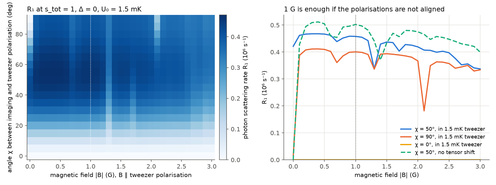
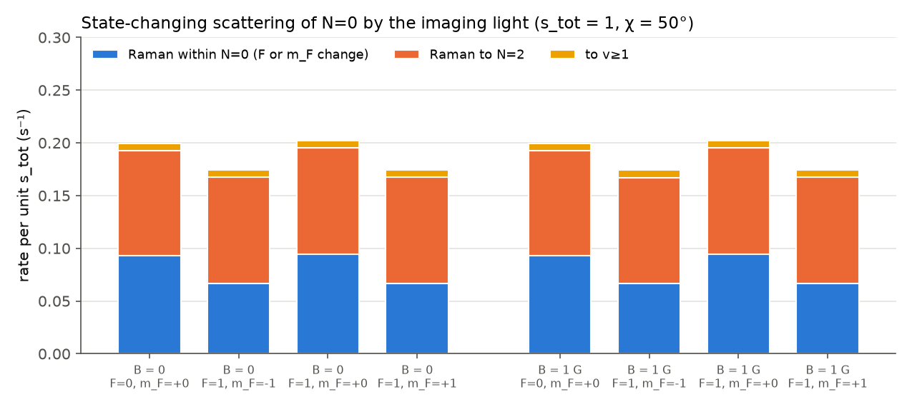
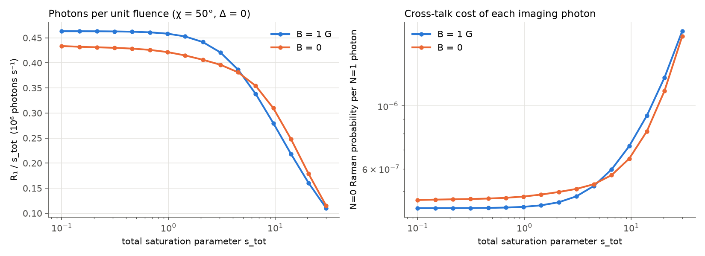
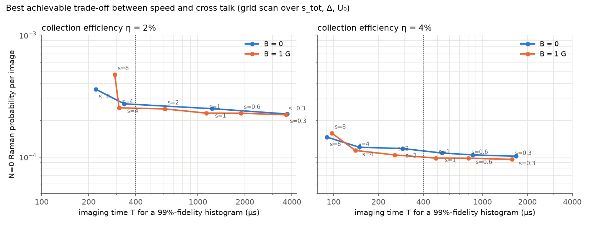
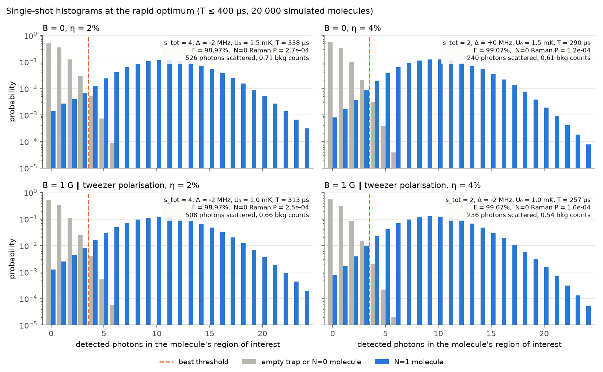

# Results: rapid resonant N=1 imaging of CaF at B = 1 G

Interactive version: [CaF Imaging at 1 G](https://claude.ai/artifact/HjqQHnMSujqfdPKip5igzH). This is a private artifact; share it from its Share menu.

## Upshot

1. **Yes, the scheme works at 1 G.** The only condition is that the imaging polarisation must not be parallel to **B**.
   - At 1 G, N=1 scatters 0.46×10⁶ photons s⁻¹ per unit s_tot, against 0.42×10⁶ at 0 G. Both use a 1.5 mK tweezer, **B** ∥ tweezer polarisation, and imaging polarisation 50° away.
   - A 99%-fidelity histogram needs the same ≈500 scattered photons (η = 2%) or ≈235 (η = 4%) in both cases.
2. **The cross talk onto an N=0 qubit does not depend on the field.**
   - The light is 19.2 GHz from X(N=0)→A(J′=½,−), and 1 G moves that line by only 7×10⁻⁵ of the detuning.
   - The Raman probability is **P_Raman = r_R · s_tot · T**, with r_R = 0.20 s⁻¹ at both 0 and 1 G. That is ≈4.4×10⁻⁷ per scattered imaging photon.
   - Parity forbids an N=0 molecule from ever appearing in the bright peak.
3. **Optimised settings** (F = 99%, imaging time ≤ 400 µs):

   | η | s_tot | Δ | U₀ | T | photons | **P_Raman / image** |
   |---|---|---|---|---|---|---|
   | 2% | 4 | −2 MHz | 1.0 mK | 313 µs | 508 | **2.5×10⁻⁴** |
   | 4% | 2 | −2 MHz | 1.0 mK | 257 µs | 236 | **1.0×10⁻⁴** |

   Imaging 10× slower (s_tot = 0.3, T ≈ 1.6–3.7 ms) lowers P_Raman by only ≈10%. So *rapid* imaging costs almost nothing in cross talk.
4. **Why the trade-off is flat.** The 12 → 4 level system saturates very softly.
   - Photons per unit fluence, R₁/s_tot, fall only from 0.46 to 0.39 ×10⁶ s⁻¹ between s_tot = 0.1 and 4.
   - So intensity × time for a fixed photon number is almost constant.
   - Above s_tot ≈ 5, dark-state pumping outruns remixing, and each photon gets more expensive (figure 2).
5. **The fidelity ceiling is heating and loss, not cross talk.**
   - Recoil heating is 2E_rec = 0.88 µK per photon, so a molecule boils out of a 1 mK trap after ~10³ photons.
   - With trap-light loss (assumed 4×10⁻⁵ per photon) and stray light, the best fidelity is ≈99.2% at η = 2% and ≈99.7% at η = 4%.

## 1. Brightness vs field: dark states



A fixed polarisation driving 12 X(N=1) sublevels into 4 A(J′=½,+) sublevels leaves at least 8 dark states. Three things can remix them:

- **Larmor precession at 1 G.** It runs at 0.43, 1.11 and 0.70 MHz for F = 1⁻, 1⁺ and 2.
- **The tweezer's tensor light shift on N=1.** The polarisability spread is 20% of U₀, so ≈6 MHz at 1.5 mK.
- **The two-photon detunings between the four sidebands.**

What the map shows:

- **Tensor shift alone works at B = 0,** but only if the imaging polarisation is ~30–70° from the tweezer polarisation.
- **At 1 G with B ∥ tweezer polarisation, any χ ≳ 30° works,** including χ = 90°.
- **The failure mode is χ = 0.** Imaging polarisation ∥ **B** ∥ tweezer polarisation keeps m conserved, and nothing remixes.
- **Narrow dips (e.g. 1.3 G and 2.1 G at χ = 90°)** are two-photon resonances. There, a Zeeman shift cancels a tensor-shift difference between two sublevels, and a coherent dark state reappears. At 1 G you are not on one, but check your exact field and angle.

**Practical note.** If all four sidebands sit exactly on their hyperfine-manifold centres, coherent dark states form between manifolds, and at some depths the scattering drops ~5×. Offsetting the sidebands by +1, −1, +2, −2 MHz (≪ Γ = 8.3 MHz) removes this at every depth tested. All results use these offsets and a 2:1:2:3 power split (J=½ F=1 : F=0 : J=3/2 F=1 : F=2).

The OBE is the secular approximation, which keeps each sideband coupled only to its own manifold. It agrees with the full multi-frequency time-dependent model to within 3–8%, and is the more conservative of the two.

## 2. Cross talk on N=0



Kramers–Heisenberg amplitudes go through A(J′=½,−) at Δ₀ = 19.2 GHz and A(J′=3/2,−) at 52 GHz, summed coherently. Per unit s_tot:

| N=0 state | Raman within N=0 | → N=2 | → v≥1 | total state-changing |
|---|---|---|---|---|
| F=0 | 0.093 s⁻¹ | 0.099 s⁻¹ | 0.007 s⁻¹ | **0.20 s⁻¹** |
| F=1, m_F=0 | 0.095 | 0.100 | 0.007 | **0.20** |
| F=1, m_F=±1 | 0.067 | 0.100 | 0.007 | **0.17** |

These values are identical at 0 and 1 G to three digits. Check against the two-level estimate (Γ/2)s(Γ/2Δ₀)² = 1.2 s⁻¹: the light is split over four sidebands, and each line carries angular weight < 1, which accounts for the difference. Scattering per photon:

$$\frac{P_{\rm Raman}}{N_{\rm ph}}=\frac{r_R}{R_1/s_{\rm tot}}\approx\frac{0.20\ {\rm s^{-1}}}{0.46\times10^{6}\ {\rm s^{-1}}}\approx4.4\times10^{-7}$$

This matches the paper's figure of merit, R_off/R_fl ≈ 9Γ²/Δ² ~ 10⁻⁶, which also counts Rayleigh scattering.



## 3. Histograms and the speed/cross-talk trade-off



The grid scan covers 2 fields × U₀ ∈ {1, 1.5, 2.5} mK × s_tot ∈ {0.3 … 8} × Δ ∈ {−6 … 0} MHz. Each point runs 3000 trajectories. The front shows the least Raman probability that reaches F = 99% within a given imaging time. At every speed, 0 G and 1 G agree to within ~10%, which is about the Monte-Carlo resolution.



## 4. Sensitivity to uncertain inputs (rapid 1 G optimum)

| change | η = 4%: P_Raman at F = 99% | η = 2%: best reachable F |
|---|---|---|
| baseline | 1.03×10⁻⁴ | 99.05% |
| X–A differential shift 0 / 15 MHz per mK (baseline 5) | 1.07 / 1.08×10⁻⁴ | 99.16 / 98.45% |
| trap-light loss 0 / 10⁻⁴ per photon (baseline 4×10⁻⁵) | 0.99 / 1.07×10⁻⁴ | 99.28 / 98.80% |
| stray light ζ = 10⁻⁴ / 3×10⁻³ (baseline 10⁻³) | 0.68 / 1.52×10⁻⁴ | 99.62 / 98.02% |
| N=1 tensor spread 10% (baseline 20%) | 1.08×10⁻⁴ | 98.98% |
| B ∥ tweezer axis instead of ∥ tweezer polarisation | 1.14×10⁻⁴ | 99.02% |

At η = 4% the answer is robust, and only stray light matters. At η = 2%, 99% is marginal. The inputs that matter most are stray light, the X–A differential light shift and trap-light loss, so they are the ones worth measuring.

## Model and assumptions

- **Access to the paper.** The full text of arXiv:2406.02391 could not be read, because this environment blocks arxiv.org and the publisher sites. Web-search summaries confirmed four points:
  - N=1 is imaged on resonance with X(v=0,N=1)→A(J′=½,+), with all hyperfine lines addressed.
  - The qubit is in N=0 hyperfine states.
  - The imaging tweezer is ~20× deeper than the coherence depth.
  - The paper's figure of merit is 9Γ²/Δ² ~ 10⁻⁶.

  Beam geometry, intensities and duration are therefore the optimisation variables rather than inputs.
- **Structure.** X(N≤3) uses the full hyperfine + Zeeman Hamiltonian (Childs, Goodman & Goodman 1981). It reproduces the N=1 levels at 0, 76.3, 122.9 and 147.8 MHz and the N=0 splitting of 122.56 MHz. A(J′=½,±) and A(J′=3/2,−) are treated in Hund's case (a), with Λ-doubling 1.36 GHz and (+) above (−). If that order is reversed, Δ₀ = 21.9 GHz and all Raman numbers scale by ×0.77.
- **Decay.** b₀₀ = 0.975; v=1,2 are repumped via A(v=0) at 2π×1 MHz; v≥3 is lost at 2.5×10⁻⁵ per photon.
- **Tweezer.** 780 nm, w₀ = 1 µm, T₀ = 40 µK. N=1 tensor spread is 20% of U₀ (Burchesky *et al.*, PRL 127, 123202). The X–A differential scalar shift of 5 MHz/mK is a guess (see sensitivity). Trap-light loss is 4×10⁻⁵ per photon at 1.5 mK, scaled ∝ U₀; this comes from 90% retention after 2700 photons in arXiv:1807.00740.
- **Motion.** Classical trajectories in the Gaussian tweezer with recoil kicks along the imaging beam plus random emission. The scattering rate is interpolated from R(Δ_local, local intensity), including Doppler shift, differential light shift and position-dependent tensor shift. The internal state is treated quasi-statically.
- **Imaging beam.** Retro-reflected beam perpendicular to the tweezer; the two passes add incoherently (no standing wave).
- **Detection.** Photon-counting camera, η = collection × transmission × QE. Stray light is ζ = 10⁻³ of a two-level scatterer's collected light, plus 0.01 dark counts/ms. The threshold is optimal for a 50/50 prior.
- **Not included (as agreed).** Differential light shifts and dephasing of the N=0 qubit. The differential light shift is ≈3 Hz × s_tot for the clock pair and is cancelled by the paper's mid-image echo.

## Reproduce

```bash
pip install -r requirements.txt
python -m pytest -q tests
PYTHONPATH=. python scripts/fig_physics.py                 # OBE / Raman figures (~5 min)
PYTHONPATH=. python scripts/run_scan.py                    # grid scan (~40 min on 4 cores)
PYTHONPATH=. python scripts/analyze_scan.py                # optima + Pareto figure
PYTHONPATH=.:scripts python scripts/final_runs.py          # histograms, explorer data, sensitivity
PYTHONPATH=.:scripts python scripts/sensitivity_maxF.py
python scripts/summarize.py && python scripts/build_explorer.py
```
